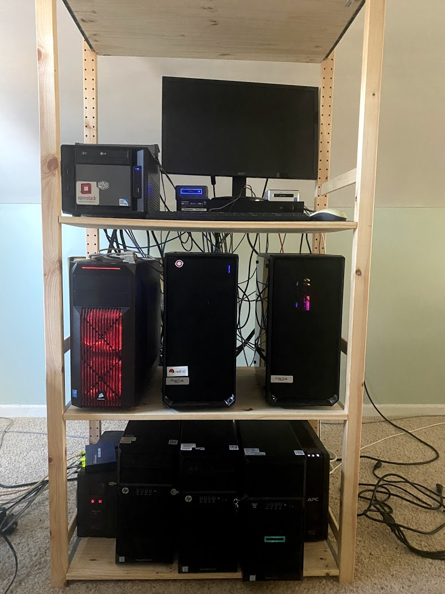

# MATRIX.lab (aka LINUXREVOLUTION.COM)
  

## Status
Untested.  I am currently making a TON of changes to make my lab "Hybrid".  
Environment is currently being used to test OCP4, RHACM on AWS/on-prem and AWS GovCloud.  
There is a lot to unpack here.

## Overview
My Homelab dedicated to deploying portions of the Red Hat product portfolio and AWS integration.
One of the goals (currently) is to build something somewhat "stateless" or shortlived.   
It is primarily an IaaS and PaaS initiative.  This is intended to be a "lab" 
installation - I would not use some of these tactics in a production or business
environment.  

An obvious question you might ask (if you know that I work for Red Hat, that is):  why am I using VMware?  
First of all: how *dare* you!  Second: Great question.  Many of my customers who are still hosting on-prem, use VMware.

Lastly, this is NOT a "how-to", an implementation guide, best-practices lab, etc... I do a number of things with this lab I would never do (or recommend/allow anyone else to do) in a business or production environment.

### DNS and Domains
| Domain                  | Purpose                                                | Provider/Service
|:------------------------|:-------------------------------------------------------|:----------------:|
| matrix.lab              | Internal Only domain I use for my lab                  | Red Hat IdM      |
| linuxrevolution.com     | External (and now Internal) domain I use for.. testing | AWS Route 53     |
| clouditoutloud.com      | External (only) domain for AWS resources               | AWS Route 53     |
| gov.clouditoutloud.com  | External (only) domain for AWS resources in GovCloud   | AWS Route 53     |


## Products
* Red Hat IdM
* Red Hat OpenShift 4.6
* Red Hat Adv Cluster Management (still needs to be configured though)
* Red Hat Hyperconverged Infrastructure for Virtualization 1.7 (RHHI-V - the Gluster one on RHEL 7)
* Red Hat Satellite 6.7
* Red Hat Ansible Tower 3.7.3 
* VMware vSphere 6.7 (hosting the OpenShift)
* freeNAS (iSCSI and NFS for OpenShift)

## PHYSICAL HOSTS 
| Hostname | Operating System         | Purpose      | Model, Proc, Mem Size                               | IP (public) | IP (storage) | Price (approx)
| :--------|:------------------------:|:-------------|:----------------------------------------------------|:-----------:|:------------:|:--------------|
| ZION     | Red Hat Enterprise Linux | Utility Host | NUC5i5RYB, Core(TM) i5-5250U CPU, 15G               | 10.10.10.10 | 172.16.10.10 | $900
| NEO      | RHV 4.3                  | Hypervisor   | HP ProLiant ML30 Gen9, Xeon(R) CPU E3-1220 v5 , 62G | 10.10.10.11 | 172.16.10.11 | $1200
| TRINITY  | RHV 4.3                  | Hypervisor   | HP ProLiant ML30 Gen9, Xeon(R) CPU E3-1220 v5 , 62G | 10.10.10.12 | 172.16.10.12 | $1200
| MORPHEUS | RHV 4.3                  | Hypervisor   | HP ProLiant ML30 Gen9, Xeon(R) CPU E3-1220 v6 , 62G | 10.10.10.13 | 172.16.10.13 | $1200
| DOZER    | VMware ESX 6.7u3         | OCP lab      | Asus z490-e Core(TM) i9-10850K, 131G                | 10.10.10.14 | 172.16.10.14 | $1900
| TANK     | VMware ESX 6.7u3         | OCP lab      | Asus z490-e Core(TM) i9-10850K, 131G                | 10.10.10.15 | 172.16.10.15 | $1900
| APOC     | VMware ESX 6.7u3         | OCP ACM      | ASUS X99-PRO/USB 3.1, Xeon(R) CPU E5-2630 v3 , 94G  | 10.10.10.18 | 172.16.10.18 | $800
| SATI     | Red Hat Enterprise Linux | Utility Host | NUC7i7BNB, Core(TM) i7-7567U CPU , 7.5G             | 10.10.10.17 | 172.16.10.17 | $900
| SERAPH   | FreeNAS                  | Storage Node | ASRock Z77E-ITX, i5-3570K, 16GB                     | 10.10.10.19 | 172.16.10.19 | $800

Command to retrieve Manufacturer, Model, Proc, and Memory:  
```
echo "`dmidecode -s system-manufacturer` `dmidecode -s baseboard-product-name`,`lscpu | grep "^Model name:" | grep -o -P '(?<=Intel\(R\)).*(?=\@)'`, `free -h | grep "Mem:" | awk '{ print $2 }'`"
```

### ZION 
* KVM Hypervisor 
 *  Red Hat IDM (rh7-idm-srv01)
 *  Red Hat Ent Linux 8 (rh8-util-srv01)
 
### SATI 
* KVM Hypervisor 
 *  Red Hat IDM (rh7-idm-srv02)
 *  LibreNMS (rh7-lms-srv01)

### DOZER / TANK
* VMware ESX 6.7 Hypervisors
  * OCP 4 
  * OCS 4

### APOC (the workhorse)
* This box has a lot of disk and memory to run the long-running VMs.
* KVM Hypervisor hosting the following Guests:  
  *  Satellite 6 (rh7-sat6-srv01)
  *  Ansible Tower (rh7-ans-srv01)

### CYPHER (offline)
* Running ESX to test OCP4 IPI

### SERAPH (offline)
* FreeNAS host for NFS and iSCSI

### NEO/TRINITY/MORPHEUS (offline)
Our heroes will function as hypervisors or compute nodes.  
* RHV Hypervisors (or RHEL 7 as RHV Hypervisors)  
* These nodes will change purpose often.. not "long-running" hosts.

---
## Physical View
  

## Network Services (infrastructure)

| Service        | Purpose                           | Host(s)                                      |
|:---------------|:----------------------------------|:---------------------------------------------|
| NTP            | Network Time Protocol             | 10.10.10.10 <BR> 10.10.10.17 <BR> 10.10.10.19
| DNS            | Domain Name Service               | 10.10.10.121 <BR> 10.10.10.122
| Auth           | Authentication <BR> Authorization | 10.10.10.121 <BR> 10.10.10.122
| PXE, TFTP, WWW | Kickstart for network             | 10.10.10.10 (*)

* otherwise: 10.10.10.102 if Satellite is configured to provide Provisioning

## Host Overview
NOTE:  These memory values are not yet solidified.
### Infrastructure Nodes
| Hostname          |            Product              |  Purpose             | Proc, Mem Size | Hypervisor |
| :---------------- |:-------------------------------:|:--------------------:| --------------:|:----------:|
| RH7-IDM-SRV01     | Red Hat Identity Management     | IdM and DNS          | 2, 1024m       | zion       |
| RH8-UTIL-SRV01    | Red Hat Enteprise Linux         | Util, DMZ Bastion    | 2, 1024m       | zion       |
| ----------------- | -----------------------------   | -------------------  | -------------- | ---------- | 
| RH7-IDM-SRV02     | Red Hat Identity Management     | IdM and DNS          | 2, 1024m       | sati       |
| RH7-LMS-SRV01     | libreNMS                        | Monitoring           | 2, 1024m       | zion       |
| ----------------- | -----------------------------   | -------------------  | -------------- | ---------- | 
| RH7-SAT6-SRV01    | Red Hat Satellite 6             | Host Management      | 2, 10240m      | tank       |
| RH7-ANS-SRV01     | Red Hat Ansible                 | Host Management      | 2, 4096m       | sati       |
       
## External Repos

| Repo | URL   |
| :--: | :---- |
| EPEL | https://fedoraproject.org/wiki/EPEL |
| HP   | http://downloads.linux.hpe.com/SDR/repo/ |

## HARDWARE OVERVIEW
<pre>
                         +-----------------+
  SOPHOS XG UTG          |    MR FIREWALL  |
                         +-----------------+
                                  |
                                  |
                                  |
                         +------- v--------+
      Cisco SG328        |    MR SWITCH    |
                         +-----------------+
                                  |
                                  |
                                  |
                                  |
                           +------v------+
                           |             |
                           |             |  RH8-UTIL-SRV01
                           |             |  (Bastion)
                           +-------------+


                            VMWARE VSPHERE 6.7                          
                    (OCP4)                        (ACM)
       +-------------+  +------------+   ||   +------------+
       |             |  |            |   ||   |            | 
       |    DOZER    |  |    TANK    |   ||   |    APOC    | 
       |             |  |            |   ||   |            | 
       +-------------+  +------------+   ||   +------------+ 
              \\              // 
             (iSCSI)       (iSCSI)    
                \\          // 
                +-\---------/-+
                |             |
                |   SERAPH    |
                |             |
                +-------------+
                    FreeNAS


                            RHHI-V 1.7 CLUSTER
              +-------------+  +-----------+  +------------+
              |             |  |           |  |            |
              |     NEO     |  |  TRINITY  |  |  MORPHEUS  |
              |             |  |           |  |            |
              +-------------+  +-----------+  +------------+


</pre>

---
## Network Overview
Due to the dependency of my RHHI-V cluster needing 2 x LAG per node, I use the SG300-28 for 
my RHHI hosts as that switch can accommodate 8 LAG.  As such, the LGS326-26 (4 x LAG) is 
primarily for the "NAS/SAN" interfaces.

## Switch Layout - Cisco SG300-28 (RHHI-V and Guest interfaces)
| Switch Port | Host     | Host Int | LAG | Switch Port | Host      | Host Int | LAG |
|:-----------:|:--------:|:--------:|:---:|:-----------:|:---------:|:--------:|:---:|
|  gi1        | zion     | enp0s25  |     | gi2         | sati      | enp0s25  |     |
|  gi3        | neo      | eno1     |     | gi4         | trinity   | eno1     |     |
|  gi5        | morpheus | eno1     |     | gi6         |           |          |     |
|  gi7        | neo      | ens3f0   |  1  | gi8         | neo       | ens3f1   |  1  |                     
|  gi9        | trinity  | ens3f0   |  2  | gi10        | trinity   | ens3f1   |  2  |
|  gi11       | morpheus | ens3f0   |  3  | gi12        | morpheus  | ens3f1   |  3  |
|  gi13       |          |          |     | gi14        |           |          |     |
|  gi15       | dozer    | vmnic0   |     | gi16        | dozer     | vmnic3   |     |
|  gi17       | tank     | vmnic0   |     | gi18        | tank      | vmnic3   |     |
|  gi19       | neo      | ens3f2   |  4  | gi20        | neo       | ens3f3   |  4  |
|  gi21       | trinity  | ens3f2   |  5  | gi22        | trinity   | ens3f3   |  5  |
|  gi23       | morpheus | ens3f2   |  6  | gi24        | morpheus  | ens3f3   |  6  | 
|   -         |    -     |    -     |  -  |   -         |           |    --    |     |
|  gi25       |    -     |    -     |     | gi26        | LINK to LGS326-26 |      |    --    |     |
|  gi27       |          |          |     | gi28        |           |      |    --    |     |

## 802.3ad LAG groups (configured on Mr Switch)
| LAG  | Name 
|:----:|:------
| LAG1 | neo-storage
| LAG2 | trinity-storage
| LAG3 | morpheus-storage
| LAG4 | neo-guest
| LAG5 | trinity-guest
| LAG6 | morpheus-guest 
| LAG7 | unassigned  
| LAG8 | unassigned

## Switch Layout - Linksys LGS326-26 (storage interfaces, ilo/mgmt interfaces)
| Switch Port | Host     | Host Int | LAG | Switch Port | Host     | Host Int | LAG |
|:-----------:|:--------:|:--------:|:---:|:-----------:|:--------:|:--------:|:---:|
|  gi1        | seraph   | em0      |  1  | gi2         | seraph   | em1      |  1  |
|  gi3        | apoc     | ens6f0   |  2  | gi4         | apoc     | ens6f1   |  2  |
|  gi5        | neo      | ilo      |     | gi6         | trinity  | ilo      |     |
|  gi7        | morpheus | ilo      |     | gi8         |          |          |     |
|  gi9        | apoc     | eno1     |     | gi10        | dozer    | vmnic2   |     |
|  gi11       | tank     | vmnic2   |     | gi12        | serpaph  | bge0     |     |
|  gi13       |          |          |     | gi14        |          |          |     |
|  gi15       |          |          |     | gi16        |          |          |     |
|  gi17       |          |          |     | gi18        |          |          |     |
|  gi19       |          |          |     | gi20        |          |          |     |
|  gi21       | dozer    | vmnic1   |     | gi22        | dozer    | vmnic4   |     |
|  gi23       | tank     | vmnic1   |     | gi24        | tank     | vmnic4   |     |
|   -         |    -     |    -     |  -  |   -         |          |    --    |     |
|  gi25       | Router   |    -     |     | gi26        | LINK to SG300-28   |      |    --    |     |

## 802.3ad LAG groups (configured on Mr Switch)
| LAG  | Name           |
|:----:|:---------------|
| LAG1 | seraph-storage |
| LAG2 | apoc-storag    | 
| LAG3 | unassigned     |
| LAG4 | unassigned     |

## References
Snazzy "Linux Revolution" logo created at https://fontmeme.com/fonts/mr-robot-font/
